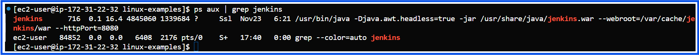
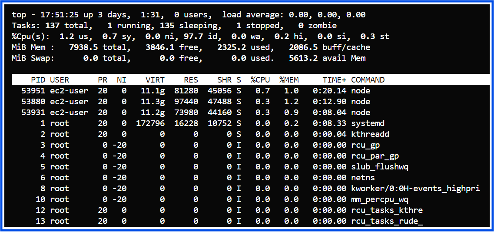
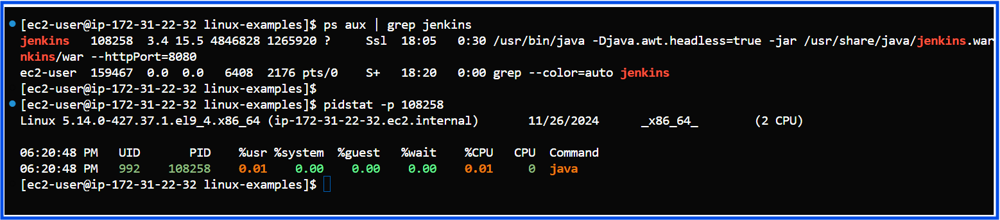
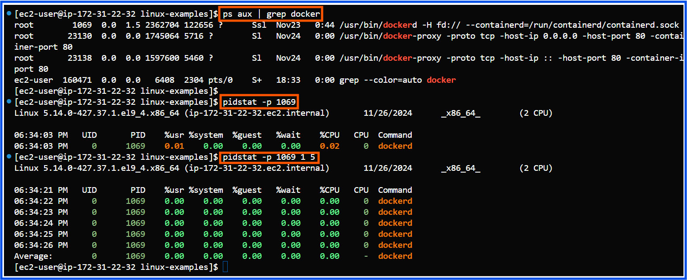
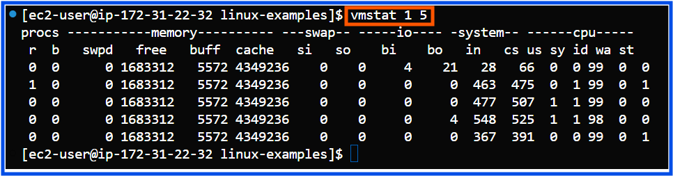

## Core Linux Administration Tasks

### 1) Process and System Monitoring
**Tasks:**
1) Monitor running processes using **ps, top, htop, and pidstat**.
2) Manage processes **(kill, pkill, nice, renice, systemctl)**.
3) Check system performance metrics such as CPU, memory, and disk I/O using **vmstat, iostat, and free**.
4) Monitor log files using **tail, head, less, and journalctl**.

1. Monitor Running Processes:
Tools like ps, top, htop, and pidstat help you inspect and monitor processes.
**Example:**
- **1.1) View running processes related to Jenkins:**
  ```bash
  ps aux | grep jenkins
  ```
  This shows all processes related to Jenkins, along with their PID and memory usage.

  

- **1.2) Inspect system-wide process details: top**
  ```bash
  top
  ```
  Provides a live view of system processes, along with CPU and memory usage statistics.

  

- **1.3) Use htop for interactive process management: htop**
  ```bash
  htop
  ```
  - Navigate the process list using arrow keys.
  - Search for Jenkins or Docker processes by pressing / and typing "jenkins" or "docker".

- **1.4) Check detailed stats of a specific process: pidstat**
  ```bash
  pidstat -p <PID>
  ```
   Replace <PID> with the process ID of Jenkins or Docker to see CPU and memory usage.
  
  **Note:**
  The pidstat command is included in the sysstat package, which might not come pre-installed on your EC2 instance.
  You can install it by following these steps:
  
  - **Amazon Linux / Amazon Linux 2 / RHEL / CentOS:**
  ```bash
  sudo yum install sysstat -y
  ```
  **pidstat-jenkins-example:**
   

  **pidstat-docker-example:**
   

- **1.5) vmstat (Virtual Memory Statistics):**
    - Purpose: Displays a snapshot of system performance, including CPU, memory, and I/O usage. Ideal for identifying bottlenecks.
      - Key Metrics:
        - CPU: us (user), sy (system), id (idle), wa (waiting for I/O).
        - Memory: free, buff, cache.
        - Disk I/O: bi (blocks in), bo (blocks out)
  **Example Use Cases:**
        - Monitor system performance in real time (every second for 5 intervals):
  ```bash
  vmstat 1 5
  ```
  **Output Example:**

  
