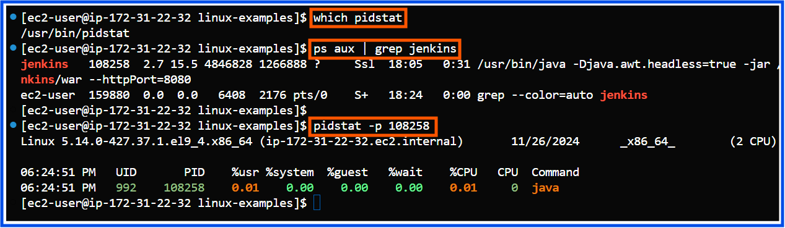

## Core Linux Administration Tasks

### 1) Process and System Monitoring
**Tasks:**
1) Monitor running processes using **ps, top, htop, and pidstat**.
2) Manage processes **(kill, pkill, nice, renice, systemctl)**.
3) Check system performance metrics such as CPU, memory, and disk I/O using **vmstat, iostat, and free**.
4) Monitor log files using **tail, head, less, and journalctl**.

1. Monitor Running Processes:
Tools like ps, top, htop, and pidstat help you inspect and monitor processes.
**Example:**
- **1.1) View running processes related to Jenkins:**
  ```bash
  ps aux | grep jenkins
  ```
  This shows all processes related to Jenkins, along with their PID and memory usage.

  

- **1.2) Inspect system-wide process details: top**
  ```bash
  top
  ```
  Provides a live view of system processes, along with CPU and memory usage statistics.

  

- **1.3) Use htop for interactive process management: htop**
  ```bash
  htop
  ```
  - Navigate the process list using arrow keys.
  - Search for Jenkins or Docker processes by pressing / and typing "jenkins" or "docker".

- **1.4) Check detailed stats of a specific process: pidstat**
  ```bash
  pidstat -p <PID>
  ```
   Replace <PID> with the process ID of Jenkins or Docker to see CPU and memory usage.
  
  **Note:**
  The pidstat command is included in the sysstat package, which might not come pre-installed on your EC2 instance.
  You can install it by following these steps:
  
  - **Amazon Linux / Amazon Linux 2 / RHEL / CentOS:**
  ```bash
  sudo yum install sysstat -y
  ```
  **pidstat-jenkins-example:**
   

  **pidstat-docker-example:**
   

- **1.5) vmstat (Virtual Memory Statistics):**
    - Purpose: Displays a snapshot of system performance, including CPU, memory, and I/O usage. Ideal for identifying bottlenecks.
      - Key Metrics:
        - CPU: us (user), sy (system), id (idle), wa (waiting for I/O).
        - Memory: free, buff, cache.
        - Disk I/O: bi (blocks in), bo (blocks out)
  **Example Use Cases:**
        - Monitor system performance in real time (every second for 5 intervals):
  ```bash
  vmstat 1 5
  ```
  **Output Example:**

  

  - r: Number of processes waiting to run (high r = CPU bottleneck).
  - wa: High values indicate I/O bottlenecks (e.g., slow disk or network)
- To detect high I/O wait during Jenkins builds, execute vmstat while a Jenkins job is running. If the 'wa' value is elevated, look into the performance of the disk or the activity of Docker containers.

- **1.6) iostat (Input/Output Statistics):**
    - **Purpose:** This tool provides insights into CPU usage and the I/O performance of storage devices and partitions.
        - **Key Metrics:**
          - **%iowait:** The percentage of CPU time spent waiting for I/O operations to finish. Elevated values suggest possible disk or network bottlenecks.
          - **r/s, w/s:** The number of read and write requests per second, showing the intensity of disk activity.
          - **rkB/s, wkB/s:** Kilobytes read and written per second, indicating the data transfer rate.
          - **%util:** The percentage of time the disk was busy. Values nearing 100% indicate the disk is a bottleneck.

  **Example Use Cases:**
  - **Monitor disk I/O in real time (update every second):**
  ```bash
  iostat -dx 1
  ```
   **Output Example:**

  

**How to Use iostat for Docker/EKS Applications?**

  **Practical Example for Docker:**
  
  **Scenario:** A container running a MySQL database is slow.
  
  **1. Run iostat:**
  ```bash
  iostat -dx 1
  ```
  - If %util is consistently above 90% or w_await is high, the disk is overloaded or slow.
  **2. Identify the container causing high disk usage:**
    
  ```bash
  docker stats
  ```
 - Look for the MySQL container's IO metrics.
  - docker stat command output example:
    
     
    

  **3. Solution:**
  - Move the database files to a faster storage backend (e.g., AWS EBS gp3 or io2 volumes).
  - Optimize database queries or reduce IOPS requirements.

 **Check Kubernetes Storage Usage:**

  For EKS, check the Kubernetes storage backends:
  
    - If the application is utilizing AWS EBS volumes, keep an eye on the performance of the attached volume:
    
        - Use AWS CloudWatch Metrics (e.g., VolumeReadOps, VolumeWriteOps) to monitor EBS volume usage.
        
        - Alternatively, on the EKS node, use iostat to check the performance of the /dev/xvda or /dev/nvme* devices.

- **1.7) sar (System Activity Reporter):**
    **Purpose:**
    - The sar command is used to collect, report, and save metrics related to system performance, such as CPU, memory, disk, and network usage. It is 
      particularly helpful for analyzing real-time system activity as well as historical trends from logs that were collected earlier.
    - **Key Metrics Tracked:**
        - **CPU usage:** %user, %system, %iowait, %idle, etc.
        - **Disk I/O:** Transfer rates, wait times, and device utilization.
        - **Memory usage:** Free and used memory, swap activity.
        - **Network usage:** Packet transfer rates and errors over time.
    - **Usage:**
        - **Real-Time CPU Usage:**
  ```bash
  sar -u 5 3
  ```
  - Captures CPU usage in real time every 5 seconds for 3 iterations.
     
    
  
   - Here’s a complete guide for using the sar command to monitor system activity, which includes enabling necessary components and troubleshooting steps:
  **Step 1: Install Sysstat**
       i) Install the package:
  ```bash
  sudo yum install sysstat -y
  ```
       ii) Verify the installation:
  ```bash
  sar -V
  ```
  **Step 2: Enable and Start the Sysstat Service**
  i) Enable the service:
  ```bash
  sudo systemctl enable sysstat
  ```
  ii) Start the service:
  ```bash
  sudo systemctl enable sysstat
  ```
  iii) Verify the service is running:
  ```bash
  sudo systemctl status sysstat
  ```

  
